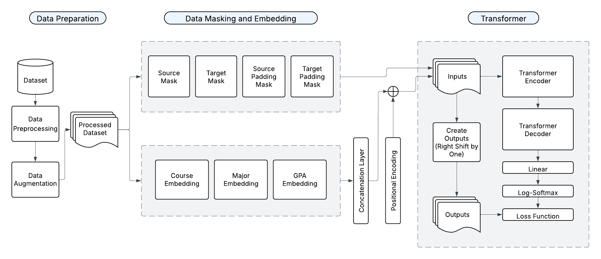

# Jointly Predicting Course and Grades Using a Transformer-Based Model
This repository includes the code used to generate the results described in this paper. Because the data comes from student information at a private university, the data itself is not publicly available. A small, anonymized subset of the data is however viewable in the data folder. 

## Abstract
Existing predictive models in learning analytics often treat student academic history as a simple sequence, overlooking the concurrent nature of courses taken within a semester. This simplification can lead to inaccurate performance predictions, particularly for students with heavy or challenging course loads. This paper introduces a **TR**ansformer for **A**cademic **C**ourse-grade **E**stimation (**TRACE**) that addresses this limitation by jointly predicting both the set of courses a student will take and their corresponding grades for an upcoming semester. Our approach encodes courses on a per-semester basis to capture the effects of course concurrency and utilizes a novel loss function combining course-set prediction with grade prediction. We demonstrate that predicting courses taken in addition to the grades in those courses leads to significant improvements in prediction quality. Trained on ten years of institutional data, our joint prediction model reduces mean absolute error by nearly 50% compared to an identical architecture that predicts grades alone. The model also outperforms traditional LSTM-based sequential models and offers interpretability through attention weights, identifying key historical courses that influence future success. This work demonstrates the utility of modern neural architectures for creating generalizable, interpretable models to support data-driven academic advising.

## Model Architecture

## Results
In order to understand both the performance of our model but also the relative importance of various features and architecture choices, we compare our model to the following alternatives and variants:

- **Transformer without course predictions ("OnlyGradesTransformer"):** During training we predict the grades in the courses actually taken, but not the courses taken. 
- **Encoder-Decoder LSTM ("EncDecLSTM"):** We utilize an encoder-decoder LSTM with attention. This closely mirrors our Transformer model setup, but replaces the Transformers in the encoder and decoder with unidirectional LSTMs with attention.
- **Unidirectional LSTM ("UniLSTM"):** We also implement a unidirectional LSTM without the encoder-decoder architecture described above. This LSTM also does not use any attention mechanism, and represents a traditional LSTM architecture.
- **XGBoost ("XGBoost"):** We treat our data as tabular with rows corresponding to a particular (student, semester, course) tuple, where we encode all relevant data (student ID, semester, course taken, grade in course) as columns with no explicit sequential connections. Note that the inclusion of semester means the model can still model the concurrency of courses taken in the same semester. Therefore, this approach allows us to closely compare the performance of a powerful machine learning algorithm against a model deep learning approach such as an LSTM or Transformer.

For each model we evaluate grade prediction using MSE and mean-absolute error (MAE), and compare the results to the model proposed in this paper ("TRACE"). We conducted cross-validation hyperparameter tuning for the XGBoost model to determine optimal hyperparameters. The results are shown below.

| Model                   |      MSE     |      MAE     |
| :---------------------- | :----------: | :----------: |
| TRACE                   | **0.0392** | **0.1339** |
| OnlyGradesTransformer   | 0.1400       | 0.2496       |
| EncDecLSTM              | 0.0530       | 0.1608       |
| UniLSTM                 | 0.0544       | 0.1619       |
| XGBoost                 | 1.3317       | 0.8818       |

## Conclusions
This study set out to develop a more holistic predictive model for student academic performance by addressing a key limitation in existing sequential models: the failure to account for the concurrent nature of courses taken within a single semester with a model which is a natural fit for this sort of data. We introduced a novel Transformer-based architecture that jointly predicts both the set of courses a student will take and the grades they will achieve in them. This approach, coupled with a custom loss function, allows the model to learn the complex, non-sequential inter-dependencies between courses, major, and historical performance. This work advances the body of learning analytics knowledge by demonstrating that for complex sequential prediction, modeling the structural properties of the sequence (i.e., concurrent semesters) and the inter-relationships of the outputs (i.e., joint course-grade prediction) can be as crucial as the choice of the underlying model architecture itself. These findings pave the way for a new class of advising tools that move beyond simple risk-flagging to provide nuanced, data-driven insights into how specific course combinations may impact student success.

### Principal Findings
Our results demonstrate the superiority of this joint prediction approach, as well as the Transformer architecture. The model we developed significantly outperformed comparison models across key metrics. Specifically, our proposed model TRACE, which jointly predicts courses and grades, achieved a mean absolute error nearly half that of an identical Transformer architecture that only predicted grades, and a mean squared error 3.5 times lower. This confirms our hypothesis that forcing the model to learn meaningful course embeddings through the course prediction task provides a richer representation that directly benefits grade prediction accuracy.

Furthermore, when compared to a traditional sequence-to-sequence model using an Encoder-Decoder LSTM with attention, our Transformer model showed marked improvements. Regardless of whether an attention mechanism is utilized or not, and regardless of whether the LSTM is unidirectional or bidirectional, the Transformer model still solidly outperformed it. 
